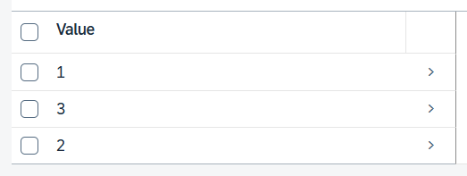
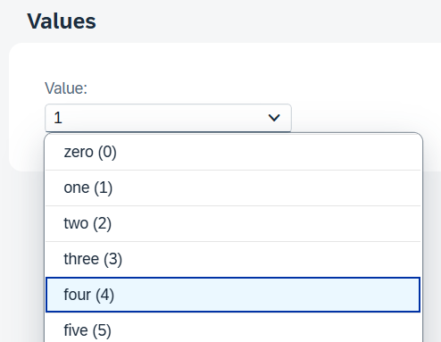
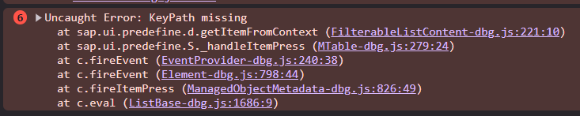
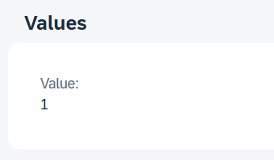
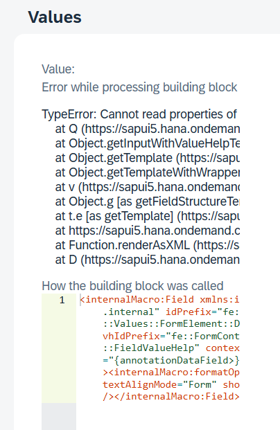

# MWE: Annotations for reusable types

This MWE demonstrates a bug that occurs with reusable types.

## Demo app description

There is an entity `Test` that contains a field `test` of type `Reusable`.

`Reusable` is a structured type with a property `value` which is itself a managed association to a value list entity `Values`.
In `Reusable`, the property `value.text` is configured to be the text for the property `value` (using `Common.Text`).

```cds
type Reusable {
    value   : Association to one Values @title : 'Value';
}

entity Test : cuid {
    test    : Reusable      @title : 'Test';
}

entity Values {
    key ID      : String    @title : 'Value';
        text    : String    @title : 'Name';
}
```

There are a few Fiori annotations for a List Report for the `Test` entity.

## Reproducing the issue

1. Run the app with `cds watch`
2. Open the Fiori app at http://localhost:4004/$fiori-preview/srv.TestService/Test#preview-app
3. Note that the list report does not display the values' names  
   
4. Open the details of one entity
5. Note that the details page does not display the value's name  
   
6. Switch to edit mode
7. Select an entry from the value list
8. Note that the value does not update in the field  
     
   The console shows the following error:  
   

## Further analysis

There are two problems

1. The values' text is not displayed.
2. The value is not updated in the field.

### Problem 1: text not displayed

I tried two different ways to annotate the `Reusable` type to display the text of the value in Fiori.

#### Attempt 1: Expressions as Annotation Values

> See #1.1 in [`app/annotations.cds`][annotations]

Using https://cap.cloud.sap/docs/cds/cdl#expressions-as-annotation-values:

```cds
annotate db.Reusable with {
    @Common : {
        Text : (value.text),
        TextArrangement : #TextFirst,
    }
    value;
}
```

This has no effect in Fiori Elements:



The reason is that there is no corresponding `Common.Text` annotation present in the metadata document.

```xml
<Annotations Target="srv.TestService.Test/test_value_ID">
    <!-- no Common.Text annotation included -->
    <Annotation Term="Common.Label" String="Value"/>
</Annotations>
```

#### Attempt 2

> See #1.2 in [`app/annotations.cds`][annotations]

```cds
annotate db.Reusable with {
    @Common : {
        Text : value.text,
        TextArrangement : #TextFirst,
    }
    value;
}
```

This does not work in Fiori elements as the field does not get displayed at all in the object page.



This is due to the annotations missing the prefix `test_` of the reusable property name.

```xml
<Annotations Target="srv.TestService.Test/test_value_ID">
    <Annotation Term="Common.Text" Path="value/text"> <!-- missing prefix test_ -->
        <Annotation Term="UI.TextArrangement" EnumMember="UI.TextArrangementType/TextFirst"/>
    </Annotation>
</Annotations>
```

#### Attempt 3

> See #1.3 in [`app/annotations.cds`][annotations]

```cds
annotate db.Reusable with {
    @Common : {
        Text : test_value.text,
        TextArrangement : #TextFirst,
    }
    value;
}
```

Results in metadata:

```xml
<Annotations Target="srv.TestService.Test/test_value_ID">
    <Annotation Term="Common.Text" Path="test_value/text"> <!-- correctly prefixed -->
        <Annotation Term="UI.TextArrangement" EnumMember="UI.TextArrangementType/TextFirst"/>
    </Annotation>
</Annotations>
```

This works in Fiori elements.

However, this makes the `Reusable` annotations depend on how the type is used (how the property is named) and thus not usable any more; also it gets reported as error by CDS language support.
I would have to copy this annotation for any usage of the reuse type, annotation the corresponding properties instead of the reuse type itself.

Also, it gets reported as an error by the CDS language support.

### Problem 2: value list

For the value list I tried 4 different approaches.

#### Attempt 1: simple custom value mapping

> See #2.1 in [`app/annotations.cds`][annotations]

Using this annotation the values aren't prefixed with `test_`:

```cds
annotate db.Reusable with {
    @Common : {
        ValueList : {
            $Type : 'Common.ValueListType',
            CollectionPath : 'Values',
            Parameters : [
                {
                    $Type : 'Common.ValueListParameterInOut',
                    LocalDataProperty : value_ID,
                    ValueListProperty : 'ID',
                },
            ],
        },
    }
    value;
}
```

This results in the following console error when selecting a value in the edit mode:


```
Uncaught (in promise) Error: KeyPath missing
    at sap.ui.predefine.d.getItemFromContext (FilterableListContent-dbg.js:221:10)
    at sap.ui.predefine.S.navigate (MTable-dbg.js:825:27)
    at sap.ui.predefine.h.navigateInContent (Popover-dbg.js:694:13)
    at Container-dbg.js:640:9
```

The metadata contains the following annotation:

```xml
<Annotations Target="srv.TestService.Test/test_value_ID">
    <Annotation Term="Common.ValueList">
        <Record Type="Common.ValueListType">
            <PropertyValue Property="CollectionPath" String="Values"/>
            <PropertyValue Property="Parameters">
                <Collection>
                    <Record Type="Common.ValueListParameterInOut">
                        <PropertyValue Property="LocalDataProperty" PropertyPath="value_ID"/> <!-- prefix test_ missing -->
                        <PropertyValue Property="ValueListProperty" String="ID"/>
                    </Record>
                </Collection>
            </PropertyValue>
        </Record>
    </Annotation>
</Annotations>
```

#### Attempt 2: manual prefix

> See #2.2 in [`app/annotations.cds`][annotations]

```cds
annotate db.Reusable with {
    @Common : {
        ValueList : {
            $Type : 'Common.ValueListType',
            CollectionPath : 'Values',
            Parameters : [
                {
                    $Type : 'Common.ValueListParameterInOut',
                    LocalDataProperty : test_value_ID,
                    ValueListProperty : 'ID',
                },
            ],
        },
    }
    value;
}
```

This works in Fiori elements as the value list local property is prefixed correctly.

However, this makes the `Reusable` annotations depend on how the type is used (how the property is named) and thus not usable any more; also it gets reported as error by CDS language support.
I would have to copy this annotation for any usage of the reuse type, annotation the corresponding properties instead of the reuse type itself.

Also, it gets reported as an error by the CDS language support.

```xml
<Annotations Target="srv.TestService.Test/test_value_ID">
    <Annotation Term="Common.ValueList">
        <Record Type="Common.ValueListType">
            <PropertyValue Property="CollectionPath" String="Values"/>
            <PropertyValue Property="Parameters">
                <Collection>
                    <Record Type="Common.ValueListParameterInOut">
                        <PropertyValue Property="LocalDataProperty" PropertyPath="test_value_ID"/> <!-- correctly prefixed -->
                        <PropertyValue Property="ValueListProperty" String="ID"/>
                    </Record>
                </Collection>
            </PropertyValue>
        </Record>
    </Annotation>
</Annotations>
```

#### Attempt 3: Expressions as Annotation Values

> See #2.3 in [`app/annotations.cds`][annotations]

I tried to make it run using the _Expressions as Annotation Values_ as in #1.1.

```cds
annotate db.Reusable with {
    @Common : {
        ValueList : {
            $Type : 'Common.ValueListType',
            CollectionPath : 'Values',
            Parameters : [
                {
                    $Type : 'Common.ValueListParameterInOut',
                    LocalDataProperty : (value_ID),
                    ValueListProperty : 'ID',
                },
            ],
        },
    }
    value;
}
```

However, CAP won't start at all, throwing the following error:

```
// [ERROR] app/annotations.cds:16:42-50: Element “value_ID” has not been found (in type:“db.Reusable”/element:“value”/“@Common.ValueList.Parameters”)
```

#### Attempt 4: auto-generated value mapping

> See #2.4 in [`app/annotations.cds`][annotations]

Using the auto-generated value mapping:

```cds
annotate db.Values with @cds.odata.valuelist;
```

The resulting metadata contains the correct parameter.

```xml
<Annotations Target="srv.TestService.Test/test_value_ID">
    <Annotation Term="Common.ValueList">
        <Record Type="Common.ValueListType">
            <PropertyValue Property="Label" String="Value"/>
            <PropertyValue Property="CollectionPath" String="Values"/>
            <PropertyValue Property="Parameters">
                <Collection>
                    <Record Type="Common.ValueListParameterInOut">
                        <PropertyValue Property="LocalDataProperty" PropertyPath="test_value_ID"/> <!-- correctly prefixed -->
                        <PropertyValue Property="ValueListProperty" String="ID"/>
                    </Record>
                    <Record Type="Common.ValueListParameterDisplayOnly">
                        <PropertyValue Property="ValueListProperty" String="text"/>
                    </Record>
                </Collection>
            </PropertyValue>
        </Record>
    </Annotation>
</Annotations>
```

However, this only works if I don't need a custom value mapping. For the app I'm developing, I need a few more parameters for `In` and `Out`, also my value list entities have more than one key property.

[annotations]: app/annotations.cds
